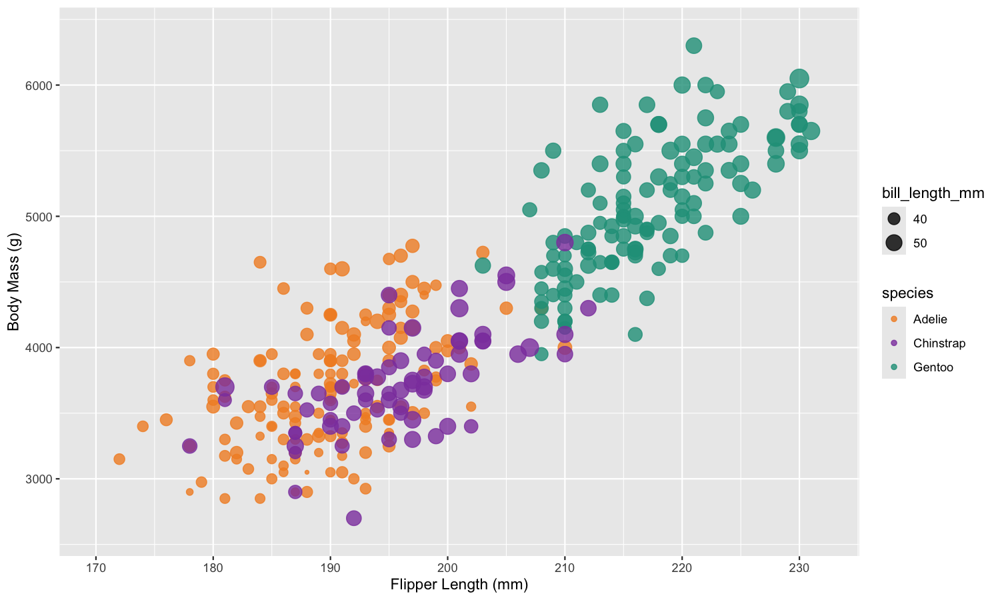
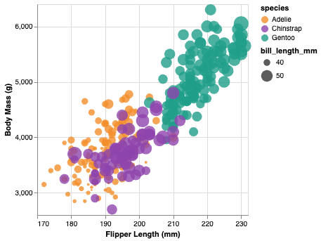
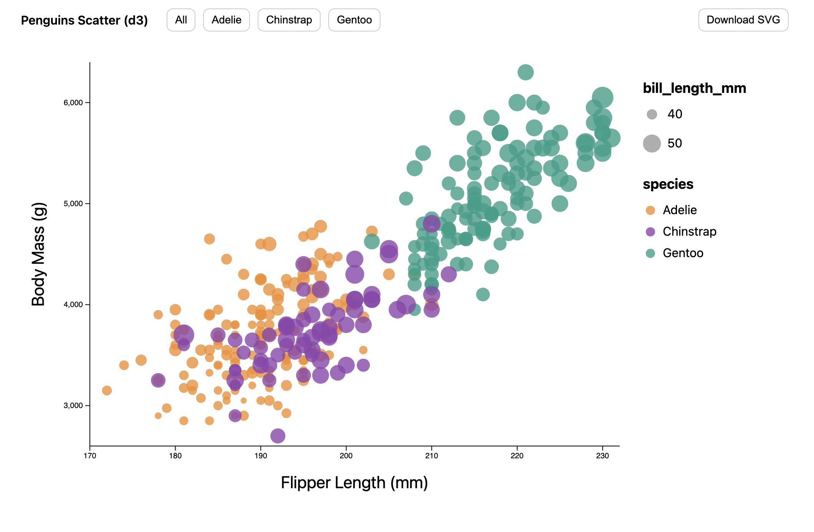
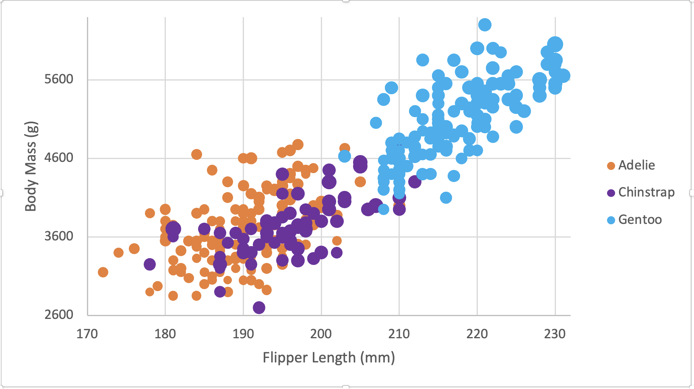
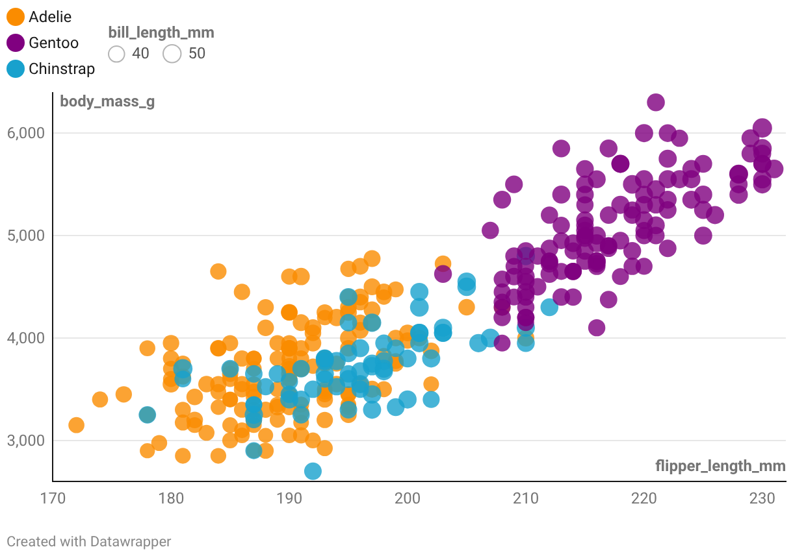

# 02-DataVis-5ways

# Assignment 2 - Data Visualization, 5 Ways

- Joel Indipiginja

- Code lives in its own tool folders (`/r-ggplot/`, `/py-altair/`, `/d3/`, `/Excel/`, `/Datawrapper/`)

# Notes:

- I mainly used ChatGPT when I got stuck on things that weren’t really chart making but were still blocking me, like installing R packages on my Mac and getting everything to run in VSCode without random errors. I am not that familiar with R so I had ChatGPT help me debug all my R code aswell. It also helped me with Altair because I thought it was broken when the HTML wasn’t showing data, but the fix was just viewing it through a local server. And for d3, it helped me clean up the layout and scaling the bubbles and then push it further with the filter buttons and the download option.

# Libraries I used(3) + Tools I Used(2):

- R + ggplot2
- Python + Altair
- JavaScript + d3.js

- Microsoft Excel
- Datawrapper

## R + ggplot2

- 

- R + ggplot2 was the easiest one for me because this is basically the original software that the reference plot came from, so it naturally matches what the assignment wants. Once I figured out how to write and run the R code in VSCode, it was super straightforward, especially because ggplot already supports mapping color and size in a simple way. The main thing I needed help with was getting the color palette to match the reference better, and ChatGPT helped me choose colors that were consistent with my other tools. Overall, ggplot2 felt very simple as long as I knew the syntax, and it was the cleanest way to get something that looked correct fast.

## Python + Altair

- 

- Altair was really easy to set up and the chart itself didn’t take much work since it’s clear how you map x/y/color/size. The part that messed me up was the exporting: it looked like it was broken because it saved as an empty output at first, and I wasn’t seeing the data show up the way I expected. Once I served it through Live Server and opened the HTML properly, the plot populated correctly and everything was there. That honestly threw me off because I spent time thinking my code was wrong when the issue was really just how it was being viewed. Tooltips were also super easy to implement, and Altair feels like a good option if you want something that’s interactive without having to build all the interaction logic yourself.

## d3.js

- 

- d3 was by far the hardest one to set up and it took the most thinking to understand what I was even doing. The biggest struggle for me was getting the scales correct and then making the layout look right (especially spacing, axes placement, and the overall structure of the chart). I had to look at examples and go back and forth with ChatGPT a lot to get it clean. Once it finally clicked, d3 was the tool that gave me the most control, and it’s also where I could add the most technical work. I added buttons to filter by species (All / Adelie / Chinstrap / Gentoo) and also added a way to download the visualization as an SVG. It was the most work, but it also felt like the most “real” programming and I can see why people use it when they want full customization.

## Microsoft Excel

- 

- Excel took the most time mostly because I started on the web version, and the web version was missing chart options that I needed (like bubble chart controls and scaling). Once I switched to the desktop app, everything got easier, but it still took a while because it’s basically all manual labor. Adelie worked early on, but I kept running into issues getting Chinstrap and Gentoo to behave correctly until I fixed the formulas and ranges, and I had to make sure Excel was filtering out the N/A values properly. It’s definitely one of the simplest tools in terms of “no coding,” but it was much slower than writing code, and I also felt limited when trying to get the bubble sizing to look exactly how I wanted. The colors were also an issue to me, as well as getting the size of the bubbles to change based on the bill length. I eventually got it to work, but the scaling is off and the legend for the Bill size was not able to populate.

## Datawrapper

- 

- Datawrapper was the easiest to use in the moment because it’s all GUI-based and you can get a chart made quickly. The downside is it came out the worst compared to my other versions because it doesn’t give enough customization to really match the reference. I ran into issues where the bubbles didn’t reflect size the way I wanted, and making specific changes was harder than I expected because you’re limited to whatever options Datawrapper gives you. For instance, I wasn't able to move the legends from the top of the graph to the right side like the demo graph suggested.Overall, Datawrapper is good if you need a fast chart that looks clean for publishing, but if you’re trying to replicate a reference very closely, it feels clunky and not that intuitive.

# Technical Achievements

- Interactivity: Added species filter buttons (All / Adelie / Chinstrap / Gentoo) so the d3 visualization can be explored by group without regenerating the chart.
- Export Feature : Implemented a Download SVG button so the d3 visualization can be saved as a high-quality vector graphic.
- Altair Web Output: Exported the visualization as an interactive HTML file (output/altair.html) and served it locally on Vscode Live Server / local HTTP server.

# Design Achievements

- Consistent color mapping across tools: Adelie = orange, Chinstrap = purple, Gentoo = teal and kept it consistent across ggplot2/Altair/d3/Excel/DataWrapper.
- Readable axis formatting: Axes do not start at 0, with clean tick spacing and clear labels.
- Used all reccommended softwares and tools from the original readme
